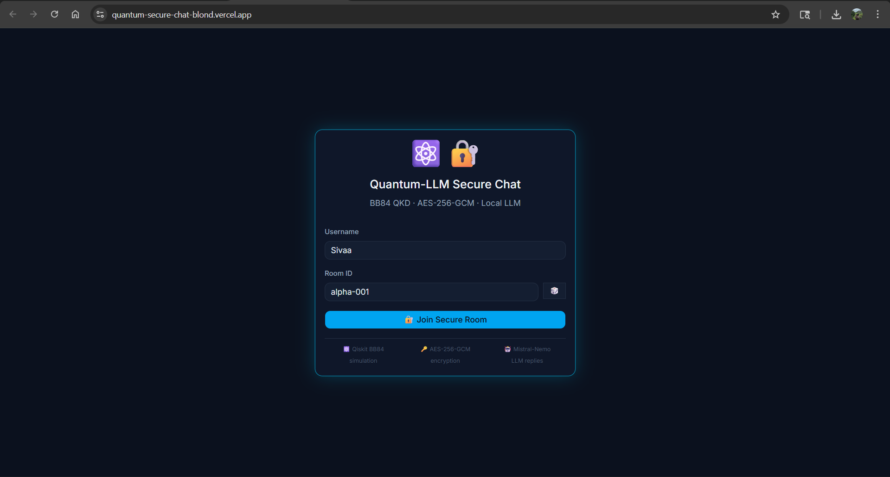
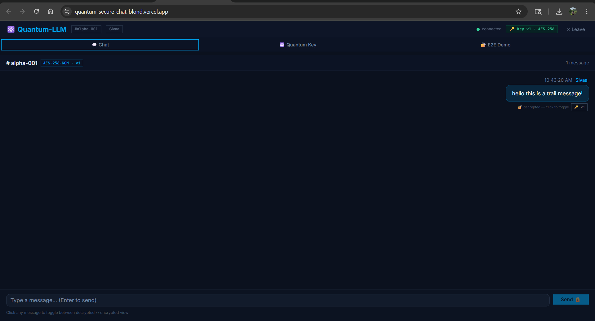
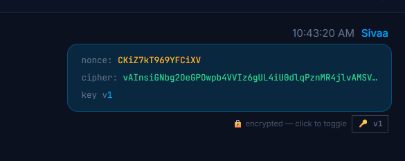
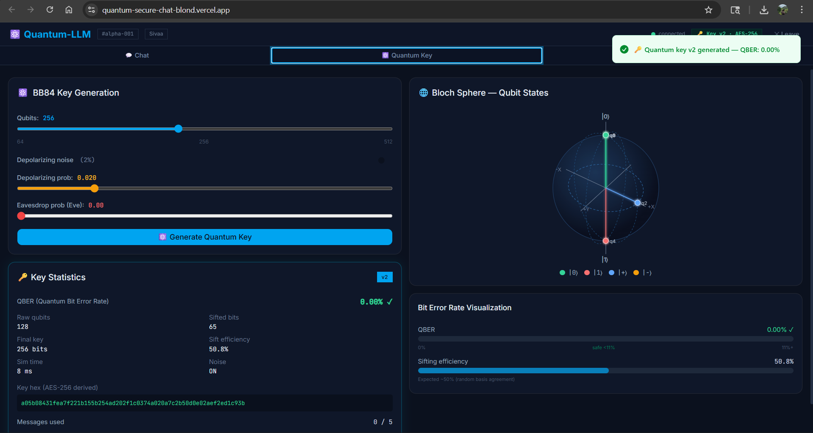
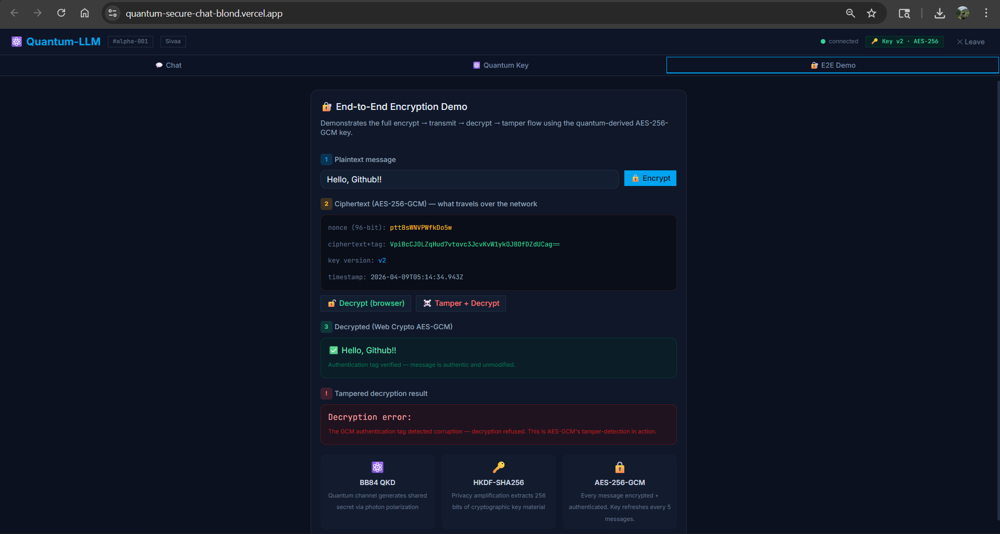
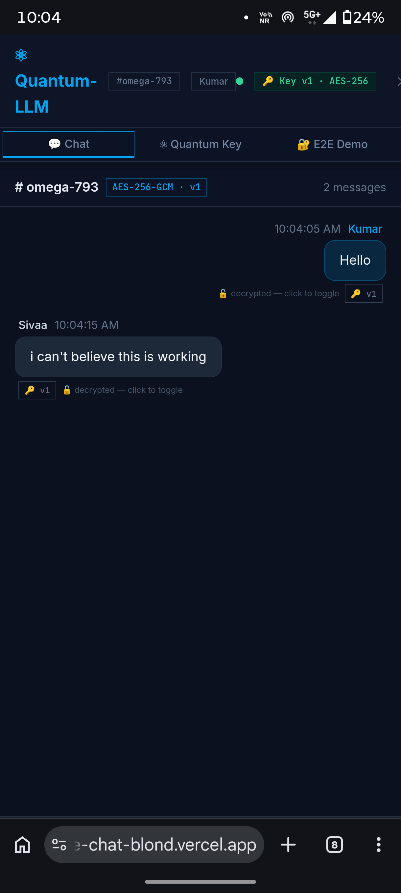

<div align="center">


<br/>

# ⚛ Quantum-Secure Chat

### Real-time encrypted messaging powered by quantum key distribution

<p align="center">
  
  
  
  
</p>

<p align="center">
  
  
  
  
</p>

<p align="center">
  <a href="https://quantum-secure-chat-blond.vercel.app">
    
  </a>
</p>

<br/>

> **A full-stack demonstration of quantum cryptography applied to real-time chat.**
> Two users. One shared room. A key born from the laws of physics. Every message
> locked with AES-256-GCM — quantum-derived, mathematically unbreakable.

<br/>

---

</div>

## 📸 Screenshots

<div align="center">

| Join Screen | Live Chat | Quantum Key Panel |
|:-----------:|:---------:|:-----------------:|
|  |  |  |

| Bloch Sphere Visualization | E2E Encryption Demo | Mobile View |
|:--------------------------:|:-------------------:|:-----------:|
|  |  |  |

</div>

---

## ⚡ What Makes This Different

Most encrypted chat apps use keys generated by **math problems** — problems that quantum computers will eventually solve. This app generates encryption keys using **quantum physics itself**: the BB84 protocol, where the randomness comes from the act of measuring photons. There is no math to crack. The uncertainty is built into the universe.

```
Traditional Chat App          Quantum-Secure Chat
─────────────────────         ────────────────────────────────────
Math-derived key              Quantum-physics-derived key
Vulnerable to QC future       Quantum-resistant by design
Key reused indefinitely       Key refreshed every 5 messages
No tamper detection           AES-GCM authentication tag
Server sees plaintext         Server NEVER sees plaintext
```

---

## 🏗 Architecture

```
┌─────────────────────────────────────────────────────────────────┐
│                         BROWSER (Client)                         │
│                                                                   │
│   React 18 + TypeScript + Tailwind + shadcn/ui                  │
│   ┌──────────┐  ┌──────────────┐  ┌─────────────────────────┐  │
│   │ Chat UI  │  │ Bloch Sphere │  │  E2E Encryption Demo    │  │
│   │ (live)   │  │ SVG Viz      │  │  encrypt→tamper→detect  │  │
│   └──────────┘  └──────────────┘  └─────────────────────────┘  │
│                                                                   │
│   Web Crypto API (AES-256-GCM) ← key never leaves browser       │
└────────────────────────┬────────────────────────────────────────┘
                         │  WebSocket (Socket.IO)
                         │  REST  /api/*
                         ▼
┌─────────────────────────────────────────────────────────────────┐
│                    FLASK SERVER (Railway)                         │
│                                                                   │
│   Flask 3.0 + Flask-SocketIO + gevent                           │
│                                                                   │
│   ┌─────────────────────────────────────────────────────────┐   │
│   │                  BB84 QKD ENGINE                         │   │
│   │                                                          │   │
│   │  Alice random bits + bases                               │   │
│   │       ↓                                                  │   │
│   │  Qiskit QuantumCircuit (N qubits)                        │   │
│   │       ↓                                                  │   │
│   │  AerSimulator + Depolarizing Noise Model                 │   │
│   │       ↓                                                  │   │
│   │  Bob random bases + measurement                          │   │
│   │       ↓                                                  │   │
│   │  Basis Sifting → QBER Check → Error Reconciliation       │   │
│   │       ↓                                                  │   │
│   │  HKDF-SHA256 Privacy Amplification                       │   │
│   │       ↓                                                  │   │
│   │  32-byte AES-256 Key  ←  mathematically distilled        │   │
│   └─────────────────────────────────────────────────────────┘   │
│                                                                   │
│   AES-256-GCM (Python cryptography 42)                          │
│   In-memory Room + Key Store (thread-safe)                       │
│   Auto key refresh every 5 messages                              │
└─────────────────────────────────────────────────────────────────┘
```

---

## 🔬 The Science — BB84 Protocol Explained

BB84 (Bennett & Brassard, 1984) is the world's first quantum cryptographic protocol. Here's how this implementation works:

```
STEP 1: Alice prepares N qubits
  ┌─────┬───────┬─────────────────────────┐
  │ Bit │ Basis │ Quantum State           │
  ├─────┼───────┼─────────────────────────┤
  │  0  │   +   │ |0⟩  (north pole)       │
  │  1  │   +   │ |1⟩  (south pole)       │
  │  0  │   ×   │ |+⟩  (+X equator)       │
  │  1  │   ×   │ |−⟩  (−X equator)       │
  └─────┴───────┴─────────────────────────┘

STEP 2: Qiskit simulates quantum channel
  [H gate] [X gate] → AerSimulator + Noise Model → measurement

STEP 3: Bob measures in random bases
  Matching basis  → correct bit  ✓
  Wrong basis     → random result ✗ (discarded in sifting)

STEP 4: Sifting (~50% retained)
  Alice: 1 0 1 1 0 0 1 0 1 1
  Bob:   1 0 ? 1 0 ? 1 ? ? 1   (? = wrong basis = discard)
  Kept:  1 0   1 0   1       1

STEP 5: QBER Estimation
  Sample 20% of sifted bits publicly
  QBER > 11% → ABORT (Shor-Preskill security bound)
  Eve intercept-resend → QBER ≈ 25% → detected automatically

STEP 6: HKDF-SHA256 Privacy Amplification
  Raw sifted bits → HKDF(SHA-256) → exactly 32 bytes → AES-256 key
```

### Security Proof
Under the Shor-Preskill security proof (2000), BB84 is **information-theoretically secure** when QBER < 11%. This means security does not rely on computational hardness assumptions — it is guaranteed by the laws of quantum mechanics. No classical or quantum computer can break it.

---

## 🛠 Tech Stack

### Backend
| Technology | Version | Purpose |
|------------|---------|---------|
| Python | 3.12.4 | Runtime |
| Flask | 3.0.3 | REST API framework |
| Flask-SocketIO | 5.3.6 | Real-time WebSocket layer |
| Qiskit | 2.3.1 | Quantum circuit simulation |
| Qiskit-Aer | 0.17.2 | Noise model + AerSimulator |
| cryptography | 42.0.8 | AES-256-GCM (Python side) |
| gevent | 24.11.1 | Async I/O for production |
| gunicorn | 23.0.0 | Production WSGI server |

### Frontend
| Technology | Version | Purpose |
|------------|---------|---------|
| React | 18 | UI framework |
| TypeScript | 5.0 | Type safety |
| Vite | 5.x | Build tool |
| Tailwind CSS | 3.4 | Styling |
| shadcn/ui | latest | Component library |
| Socket.IO Client | 4.8.1 | WebSocket client |
| Web Crypto API | native | Browser-side AES-256-GCM |

### Infrastructure
| Service | Purpose |
|---------|---------|
| Railway | Python backend hosting |
| Vercel | React frontend hosting |
| GitHub | CI/CD via push-to-deploy |

---

## ✨ Features

### 🔑 Quantum Key Distribution
- Full BB84 protocol implemented from scratch using Qiskit 2.x
- Configurable qubit count (64–512)
- Depolarizing noise model simulating real optical fiber channels
- Eavesdropper (Eve) simulation — intercept-resend attack with QBER detection
- QBER estimation with Shor-Preskill 11% abort threshold
- Parity-block error reconciliation
- HKDF-SHA256 privacy amplification → 256-bit AES key

### 🔒 End-to-End Encryption
- AES-256-GCM on **both** sides: Python (server) and Web Crypto API (browser)
- 96-bit random nonce generated per message — nonce never reused
- 128-bit GCM authentication tag — tamper detection on every message
- Replay attack protection via 5-minute timestamp window
- **Auto key refresh** every 5 messages — perfect forward secrecy

### 💬 Real-Time Chat
- Multi-room architecture — share a Room ID with anyone
- WebSocket (Socket.IO) for instant message delivery
- Typing indicators
- User join/leave notifications
- Message history on rejoin
- Click-to-toggle: view any message as raw encrypted ciphertext

### 📊 Quantum Visualizations
- **Bloch Sphere** — SVG isometric projection showing qubit states (|0⟩, |1⟩, |+⟩, |−⟩)
- **QBER Bar Chart** — real-time bit error rate with safe/unsafe thresholds
- **Sifted Bit Table** — side-by-side Alice/Bob bit comparison
- **Key Statistics** — raw qubits, sifting efficiency, simulation time

### 🔐 Encryption Demo
- Step-by-step interactive demo: encrypt → decrypt → tamper → detect
- Shows the exact nonce + ciphertext that travels over the network
- Demonstrates GCM authentication failure on single-bit corruption

---

## 🚀 Quick Start (Local)

### Prerequisites
```
Python 3.12+    →  python.org
Node.js 18+     →  nodejs.org
Git             →  git-scm.com
```

### 1. Clone
```bash
git clone https://github.com/YOUR_USERNAME/quantum-secure-chat.git
cd quantum-secure-chat
```

### 2. Backend Setup
```bash
cd backend

# Create virtual environment
python -m venv .venv

# Activate (Windows PowerShell)
.\.venv\Scripts\Activate.ps1

# Activate (macOS/Linux)
source .venv/bin/activate

# Install dependencies
pip install -r requirements.txt

# Configure environment
cp .env.example .env    # edit as needed

# Start server
python app.py
```

Backend runs at `http://localhost:5000`

### 3. Frontend Setup
```bash
cd frontend

# Install dependencies
npm install

# Configure environment
echo "VITE_BACKEND_URL=http://localhost:5000" > .env.development

# Start dev server
npm run dev
```

Frontend runs at `http://localhost:5173`

### 4. Open and Chat
Navigate to `http://localhost:5173`, choose a username and room ID, and join. Open a second tab with the same room ID to chat with yourself — or share the URL with a friend.

---

## 🌐 Deployment

### Live Instance
| Component | URL |
|-----------|-----|
| Frontend | `https://quantum-secure-chat-blond.vercel.app` |
| Backend API | `https://web-production-cb878.up.railway.app` |
| Health Check | `https://web-production-cb878.up.railway.app/api/health` |

### Deploy Your Own

**Backend → Railway**
```bash
# Set Root Directory to: backend
# Start Command: gunicorn --worker-class geventwebsocket.gunicorn.workers.GeventWebSocketWorker \
#                --workers 1 --bind 0.0.0.0:$PORT --timeout 120 app:app
#
# Environment Variables:
# FLASK_SECRET      = <random string>
# FLASK_DEBUG       = false
# BB84_NUM_QUBITS   = 128
# ALLOWED_ORIGINS   = https://your-app.vercel.app
```

**Frontend → Vercel**
```bash
npm install -g vercel
cd frontend
vercel --prod
# Set VITE_BACKEND_URL = https://your-railway-app.railway.app
```

---

## 📁 Project Structure

```
quantum-secure-chat/
│
├── backend/                        # Python Flask server
│   ├── app.py                      # Application factory + entry point
│   ├── config.py                   # Centralised configuration
│   ├── requirements.txt            # Pinned Python dependencies
│   │
│   ├── quantum/                    # BB84 QKD engine
│   │   ├── bb84.py                 # Full protocol: circuit → sifting → amplification
│   │   ├── noise_model.py          # Qiskit Aer depolarizing + readout noise
│   │   └── key_utils.py            # Sifting, QBER, reconciliation, HKDF, Bloch
│   │
│   ├── crypto/                     # Cryptography layer
│   │   └── aes_gcm.py              # AES-256-GCM encrypt/decrypt + EncryptedPayload
│   │
│   ├── api/                        # Flask REST + SocketIO
│   │   ├── routes.py               # 9 REST endpoints
│   │   ├── socket_events.py        # join/leave/message/typing SocketIO handlers
│   │   └── store.py                # Thread-safe in-memory room + key store
│   │
│   └── tests/                      # 86 unit + integration tests
│       ├── test_bb84.py            # 27 quantum protocol tests
│       ├── test_aes.py             # 22 encryption tests
│       └── test_routes.py          # 18 API integration tests
│
├── frontend/                       # React + TypeScript
│   ├── src/
│   │   ├── App.tsx                 # Root component + join state machine
│   │   ├── types/index.ts          # Full TypeScript type definitions
│   │   │
│   │   ├── lib/
│   │   │   ├── aes.ts              # Web Crypto AES-256-GCM (browser-side)
│   │   │   ├── api.ts              # Typed REST client
│   │   │   └── utils.ts            # Formatting, hex conversion utilities
│   │   │
│   │   ├── hooks/
│   │   │   ├── useSocket.ts        # Socket.IO lifecycle + emit helpers
│   │   │   ├── useQuantumKey.ts    # BB84 key state management
│   │   │   └── useAES.ts           # CryptoKey import + encrypt/decrypt
│   │   │
│   │   └── components/
│   │       ├── ChatWindow.tsx       # Real-time chat interface
│   │       ├── MessageBubble.tsx    # Click-to-toggle decrypted ↔ ciphertext
│   │       ├── QuantumKeyPanel.tsx  # BB84 controls + statistics
│   │       ├── BlochSphereViz.tsx   # SVG isometric Bloch sphere
│   │       ├── EncryptionDemo.tsx   # Interactive encrypt/tamper/detect demo
│   │       └── RoomSelector.tsx     # Join screen
│   │
│   └── package.json
│
├── docs/screenshots/               # README assets
├── Procfile                        # Railway deployment command
├── nixpacks.toml                   # Railway Python version pin
└── README.md
```

---

## 🧪 Testing

```bash
cd quantum-secure-chat
backend\.venv\Scripts\Activate.ps1   # Windows
source backend/.venv/bin/activate    # macOS/Linux

# Run full test suite
pytest backend/tests/ -v

# Run with coverage report
pytest backend/tests/ --cov=backend --cov-report=term-missing

# Run specific module
pytest backend/tests/test_bb84.py -v      # 27 quantum tests
pytest backend/tests/test_aes.py -v       # 22 encryption tests
pytest backend/tests/test_routes.py -v    # 18 API tests
```

**Test Results:**
```
86 passed in 49.23s
├── test_bb84.py    27/27 ✓   (BB84 protocol, noise model, key utils)
├── test_aes.py     22/22 ✓   (AES-GCM, tamper detection, serialisation)
└── test_routes.py  18/18 ✓   (REST endpoints, key generation, E2E roundtrip)
```

---

## 🔐 Security Architecture

### Key Lifecycle
```
BB84 Simulation (Qiskit)
         ↓
   256 raw qubits
         ↓
   Basis Sifting (~128 bits)
         ↓
   QBER Check  ──→  ABORT if > 11%
         ↓
   Error Reconciliation (parity blocks)
         ↓
   HKDF-SHA256(key_bits, salt="quantum-llm-chat-v1")
         ↓
   32-byte AES-256 key  ←── stored in-memory only, never on disk
         ↓
   Encrypt 5 messages  ──→  AUTO REFRESH  ──→  New BB84 round
```

### Threat Model
| Threat | Mitigation |
|--------|------------|
| Network eavesdropping | AES-256-GCM — ciphertext reveals nothing |
| Message tampering | GCM 128-bit authentication tag — single bit change = decryption failure |
| Replay attacks | Timestamp validation (5-minute window) |
| Key compromise | Automatic refresh every 5 messages (perfect forward secrecy) |
| Eavesdropper on quantum channel | QBER monitoring — Eve causes >25% error, aborts exchange |
| Brute force | 2²⁵⁶ key space — infeasible for any classical or quantum computer |

### Known Limitations (Honest Disclosure)
- **Simulated quantum channel**: BB84 runs on a classical simulator (Qiskit Aer), not a real quantum network. Real QKD requires single-photon sources and quantum repeaters.
- **Shared server key**: Both users derive the key via the server, not peer-to-peer. True QKD requires a direct quantum channel between Alice and Bob.
- **In-memory store**: Room state resets on server restart. Production use requires persistent storage (Redis).

---

## 📊 Key Metrics

| Metric | Value |
|--------|-------|
| BB84 simulation time | ~35ms (128 qubits) |
| Key generation (full pipeline) | < 200ms |
| Message encryption (AES-GCM) | < 1ms |
| WebSocket latency (local) | < 10ms |
| Test coverage | 86 tests / 0 failures |
| Bundle size (frontend) | ~280KB gzipped |
| Supported browsers | Chrome 90+, Firefox 88+, Safari 15+ |

---

## 🗺 Roadmap

- [ ] **Peer-to-peer key exchange** via WebRTC DataChannel — remove server from key agreement
- [ ] **Persistent message store** — Redis backend, messages survive server restart
- [ ] **Key version history** — decrypt messages from previous key epochs on rejoin
- [ ] **QKD over real hardware** — IBM Quantum / IonQ integration via Qiskit Runtime
- [ ] **Post-quantum hybrid mode** — CRYSTALS-Kyber alongside BB84 for defense in depth
- [ ] **Progressive Web App** — installable on mobile, push notifications
- [ ] **End-to-end audit log** — QBER history, key refresh timestamps, tamper attempts

---

## 🙏 References & Further Reading

- Bennett & Brassard (1984) — [Quantum Cryptography: Public Key Distribution and Coin Tossing](https://arxiv.org/abs/2003.06557)
- Shor & Preskill (2000) — [Simple Proof of Security of the BB84 QKD Protocol](https://arxiv.org/abs/quant-ph/0003004)
- [Qiskit Documentation](https://docs.quantum.ibm.com/) — IBM Quantum SDK
- [NIST SP 800-38D](https://csrc.nist.gov/publications/detail/sp/800-38d/final) — GCM Mode Recommendation
- [RFC 5869](https://www.rfc-editor.org/rfc/rfc5869) — HKDF Key Derivation

---

## 👤 Author

**Sivaahari**
- GitHub: [@sivaahari](https://github.com/sivaahari)
- Email: cb.sc.u4cys24055@cb.students.amrita.edu
- Institution: Amrita Vishwa Vidyapeetham — B.Sc. Computer Science

---

## 📄 License

```
MIT License — feel free to use, modify, and distribute.
Attribution appreciated but not required.
```

---

<div align="center">

**Built from scratch in 6 batches over 2 days**

*Quantum Physics × Cryptography × Full-Stack Engineering*

<br/>

⚛ &nbsp; If this project taught you something, leave a ⭐

<br/>

[](https://forthebadge.com)
[](https://forthebadge.com)
[](https://quantum-secure-chat-blond.vercel.app)

</div>
